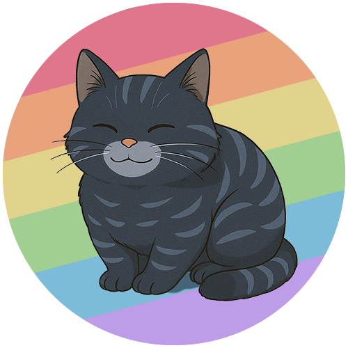
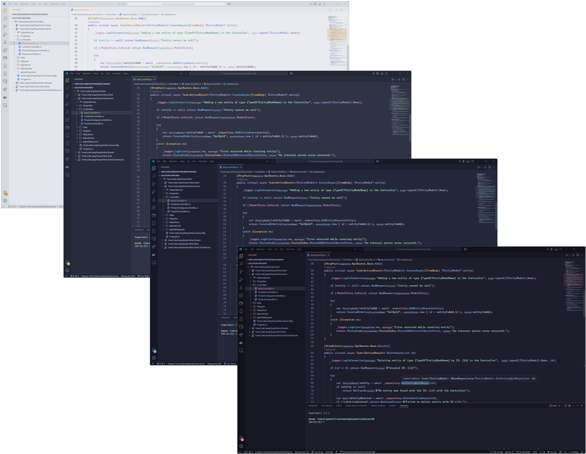
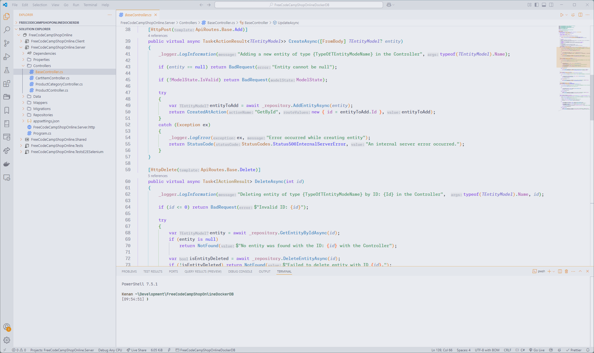
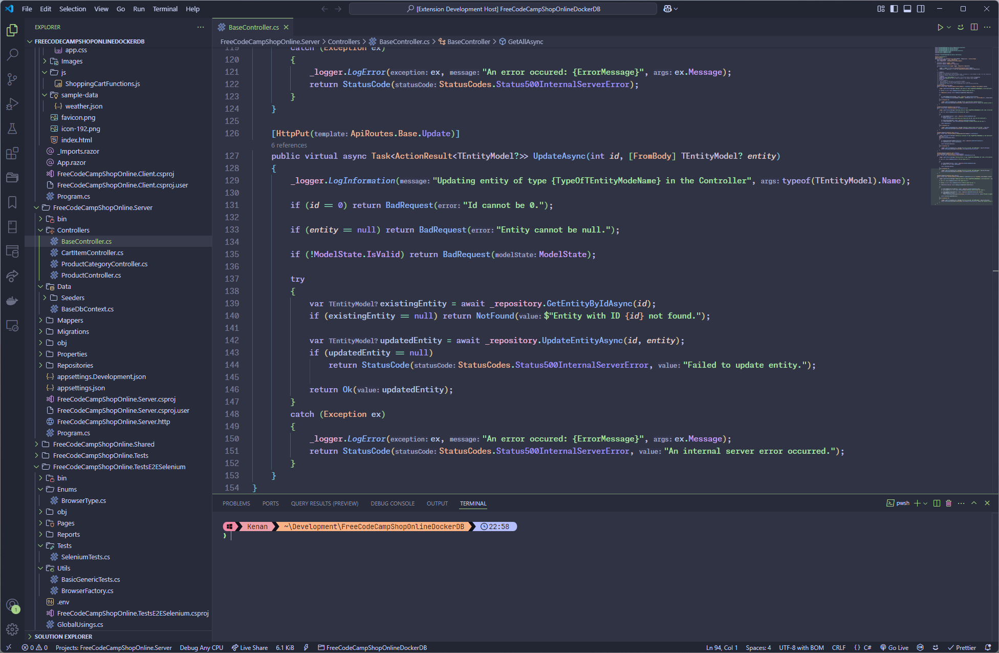
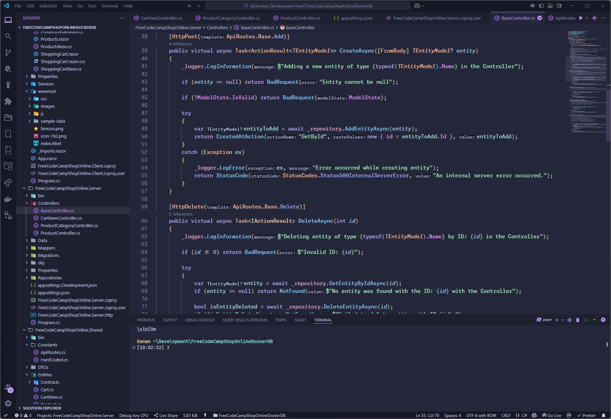
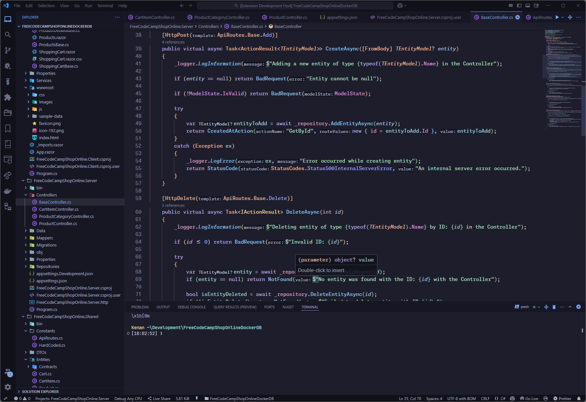

    
    <h3>Calmppuccin for <a href="https://code.visualstudio.com/">VSCode</a> </h3>

 

    

## Previews

🌻 Latte

🪴 Frappé

🌺 Macchiato

🌿 Mocha

 

## Calmppuccin: A Soothing and Optimized VS Code Theme

Calmppuccin is a visually refined theme for Visual Studio Code, designed to 
offer a harmonious coding experience. Inspired by the popular
<a href="https://marketplace.visualstudio.com/items?itemName=Catppuccin.catppuccin-vsc">Catppuccin theme</a>,  
Calmppuccin takes the beloved pastel palette and transforms it into a gentler,  
less intense version, perfect for long coding sessions without eye strain.

## Key Features

- **Enhanced Syntax Highlighting:**
Carefully optimized color choices ensure clear and  
distinguishable syntax elements, making code easier to read and navigate.

- **Reduced Eye Strain:**
Subtle and muted tones create a calming workspace that  
minimizes visual fatigue, ideal for developers working for extended periods.

- **Aesthetic Balance:** Strikes the perfect balance between functionality and beauty, 
blending soothing colors with practical design.

- **Customizable:** Offers flexibility to tweak background colors, text shades, and  
accents to suit individual preferences.

### Accents
*   `Blue`
*   `Flamingo`
*   `Green`
*   `Lavender`
*   `Maroon`
*   `Mauve`
*   `Peach`
*   `Pink`
*   `Red`
*   `Rosewater`
*   `Sapphire`
*   `Sky`
*   `Teal`
*   `Yellow`

 

Calmppuccin is more than just a theme—it's an invitation to code in comfort and style.  
Whether you're debugging complex codebases or crafting new projects, Calmppuccin  
ensures your workspace remains a serene and productive environment.